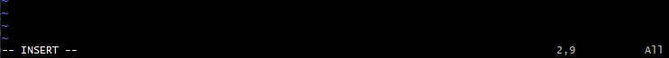
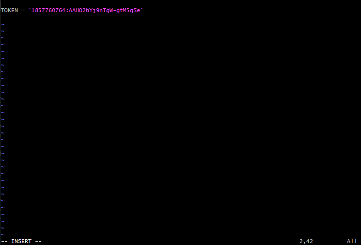
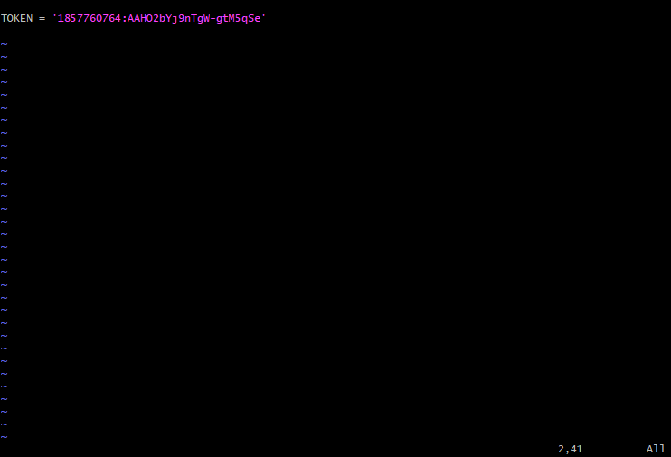
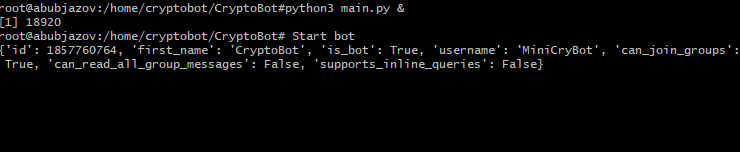
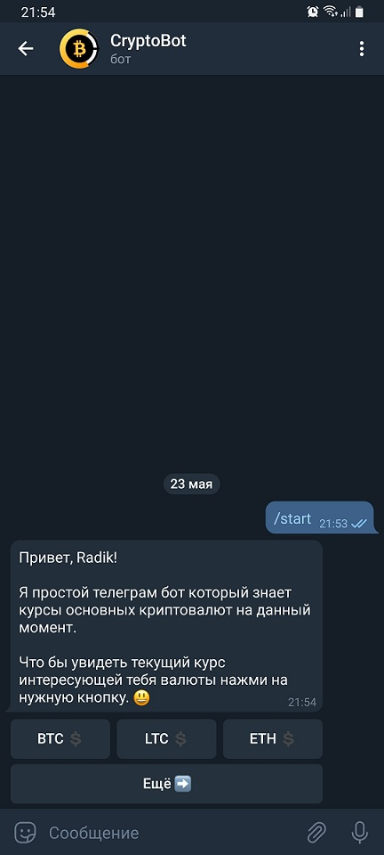
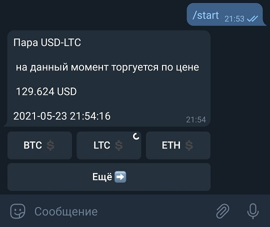
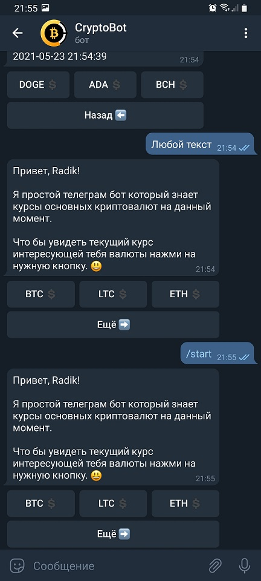

# CryptoBot
## Простейший Telegram-бот
### Описание

* [Установка, настройка и запуск бота](#anchor1)
* [Интерфейс бота](#anchor2)

Данный бот реализован на языке Python 3 с использованием библиотеки [python-telegram-bot](https://github.com/python-telegram-bot/python-telegram-bot) и предназначен для демонстрациии возможностей [Telegram Bot API](https://core.telegram.org/bots) и библиотеки python-telegram-bot. CryptoBot принимает от пользователя мессенджера ___Telegram___ запросы курса необходимой криптовалюты и возвращает текущее значение валютной пары (Доллар США - Криптовалюта) с сайта [https://global.bittrex.com/](https://global.bittrex.com/)
___

<a id="anchor1"></a>

### Установка, настройка и запуск бота 
Пример установки и настройки приводится для операционной системы (ОС) [Ubuntu 20.04.2 LTS](https://releases.ubuntu.com/20.04/)

1. Необходимо убедиться что у вас установленна актуальная операционная система и необходимое программное обеспечение нужных версий (а именно: ___Ubuntu 20.04.2 LTS___, ___Python 3.8.5___, ___pip 20.0.2___)

    * Проверка версии ОС:
      Для этого в командной строке консоли вашей ОС наберите следующую команду:
      ```# lsb_release -a```</br>
      в ответ на эту команду в консоли отобразится версия вашей ОС:
      ```# Ubuntu 20.04.2 LTS```</br>
    * Проверка версии Python3:
      Наберите в командной строке:
      ```# python3 -V```</br>
      в ответ на эту команду отобразится версия Python3:
      ```# Python 3.8.5```</br>
    * Проверка версии установщика пакетов Pip:
      Это делается при помощи команды:
      ```# pip -V```</br>
      в ответ мы получим текущую версию Pip:
      ```# pip 20.0.2 from /usr/lib/python3/dist-packages/pip (python 3.8)```</br>
На всякий случай обновлям всё програмное обеспечение набрав последовательно следующие команды:
    ``` # apt update```
    ``` # apt upgrade -y```</br></br>
2. Устанавливаем необходимые программы и пакеты (из под __root__ или с префиксом __sudo__) и настраиваем бота

    * Для работы бота потребуется библиотека python-telegram-bot версии 13.5
    ```# pip install python-telegram-bot==13.5```</br>
    * Для клонирования исходного кода с __github.com__ нам понадобится собственно сам GIT ```# apt-get install git```</br>
    * Затем необходимо создать нового пользователя нашей ОС, например _telebot_</br>
    ```# adduser telebot```</br>
    * Переходим в _домашнюю папку_ нового пользователя _telebot_</br>
    ```# cd /home/telebot/```</br>и клонируем исходный код __CryptoBot__'а в эту папку</br>
    ```git clone https://github.com/Abubjazov/CryptoBot.git```</br>
    * Теперь необходимо настроить бота перед запуском. Для этого переходим в папку /_home/telebot/CryptoBot_</br>```# cd /home/telebot/CryptoBot```</br>и набираем команду</br>```# mv -f bot_config.example.py bot_config.py```</br>для того что бы переименовать файл _bot_config.example.py_ в _bot_config.py_ в котором будет хранится токен вашего бота.
    * Затем необходимо открыть файл _bot_config.py_ и скоприровать в него токен вашего бота.
    Для этого открываем файл _bot_config.py_ в редакторе __vim__ </br>```# vim bot_config.py```</br>
    
    В отрывшемся окне редактора нажимаем клавишу "I" (при этом в левом нижнем углу окна редактора должна отобразится надпись "-- INSERT --") для того что бы перейти в режим редактирования файла
    
    После чего вы копируете или вводите токен вашего бота в строку "TOKEN = '123:werEWEDcds' "
    
    После того как вы скопировали токен в файл _bot_config.py_ нажмите клавишу "Esc" что бы выйти из режима редактирования (надпись "-- INSERT --" левом нижнем углу окна редактора должна исчезнуть)
    
    Далее необходимо выйти из редактора с сохранением внесённых изменений. Для этого необходимо ввести с клавиатуры символ " __:__ " (обычно это сочетание клавиш "Shift" + )
    После того как в левом нижнем углу окна редактора отобразится символ " __:__ "
    
    Набираем с клавиатуры последовательно "w" и "q" 
    
    и нажимаем клавишу "Enter", после чего окно редактора __vim__ будет закрыто, а все изменения в нём сохранены.</br></br>
3. Запуск бота
    После установки и настройки бота можно его запустить. Для этого перейдите в корневую папку бота</br>```# cd /home/telebot/CryptoBot```</br>и наберите команду
    </br>```# python3 main.py &```</br>в случае успешного запуска вы увидите следующее сообщение в консоли 
    
___

<a id="anchor2"></a>

### Интерфейс бота
Взаимодействие пользователя с ботом осуществляется при помощи так называемой инлайн клавиатуры, которая выводится в диалоговом окне бота вместе с приветсвенным сообщением</br>
</br>
Нажимая на соответствующие кнопки инлайн клавиатуры пользователь посылает боту запрос на вывод необходимой информации</br>
</br>
Информация выводится тут же в сообщении, происходит замена старого текста на новый</br>
</br>
После нажатия на кнопку "Ещё ➡️" бот загружает новую  клавитуру с наименованием других криптовалют</br>
</br>
Кнопка "Назад ⬅️" загружает предыдущую клавиатуру</br>
На любое входящее сообщение от пользователя бот выводит приветственное сообщение</br>
</br>
___
